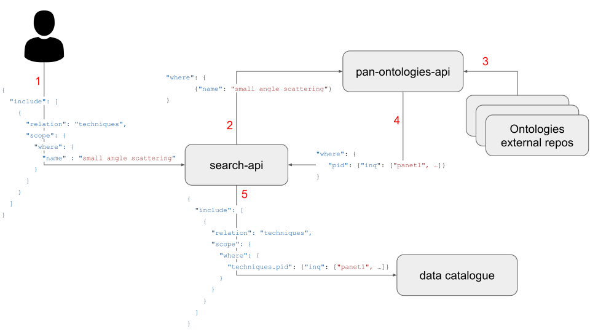

# Business logic

The application provides a data catalogue independent implementation  retrieval and processing of ontologies from an external source. Currently, only the PaNET ontology is implemented. Below is a schematic data flow depicting the role of the `pan-ontologies-api`.



Following the order depicted in the data flow:

1. The `search-api` takes a Loopback filter in accordance with the `search-api` spec.
2. The `where` part of the filter, related to, e.g., techniques, is forwarded to the `pan-ontologies-api`.
3. The `pan-ontologies-api` fetches the ontology from an external source (if not already cached).
4. The fetched ontology is processed depending on the ontology logic (see the techniques one here) and a processed Loopback 'where' condition is returned.
5. The search-api takes the `where` condition from 2 and sends it to the data catalogue according to its needs (in the figure the SciCat search-api output is shown, where the term `pid` is replaced with `techniques.pid`). 

As can be seen, only 2 and 5 require involvement from each data catalogue/search-api implementation. The `pan-ontologies-api` tries, thus, to implement the ontologies logics, hiding the details from the data catalogue specific ones. 

It is worth mentioning that the `pan-ontologies-api` is not bound to be used with a `search-api` and can be useful when needing to inspect ontologies.

# Configuring the service

**In most cases, the default configuration is sufficient to run the application.**

The application can be moderately configured using [config.json](../config.json). E.g.:

```json
{
    "technique": {
        "class": "GitHubOwlTechnique",
        "cache": {
            "class": "LoopbackCache",
            "sttl": 604800
        }
    }
}
```

The first level groups the ontology options. Multiple ontologies (and thus first level keys) can be specified, but, for now, only the `technique` one is implemented. The first `class` key indicates which ontology implementation to use and ultimately means which source to use to fetch the ontology. Currently, two such classes can be specified and their implementation is available [here](../src/misc/technique-getter.ts). The `cache` key contains the settings for the cache used to store the fetched ontology ([implementation](../src/misc/cache.ts)). Currently, only these two configurations are available. Parameters with `?` are optional.

```json
{
    "technique": {
        "class": "BioPortalTechniques",
        "bioURL"?: string,
        "apiKey": string,
        "cache": {
            "class": "LoopbackCache",
            "sttl": number <--- cache timeout in seconds
        }
    }
}
```
or 
```json
{
    "technique": {
        "class": "GitHubOwlTechnique",
        "url"?: string <--- 'raw' path to the github repo,
        "commit"?: string,
        "file"?: string <--- file path relative to the repo root,
        "cache": {
            "class": "LoopbackCache",
            "sttl": number <--- cache timeout in seconds
        }
    }
}
```

The ability to specify the cache class is left here for easier configurability in the case of future development, but, for now, only the `LoopbackCache` class exists.
