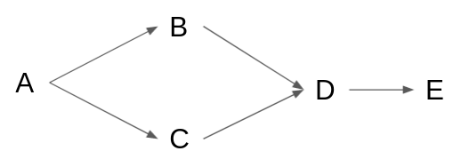

# PaNET ontology

*PaNET* is the name given to the technique ontology for PaN data. 

As part of the work carried out in the ExPaNDS [deliverable 3.2](https://zenodo.org/record/4806026#.YZPfg3vMKV4), the techniques ontology has been developed and can be found and navigated in [BioPortal](https://bioportal.bioontology.org/ontologies/PANET) and on [GitHub](https://github.com/ExPaNDS-eu/ExPaNDS-experimental-techniques-ontology).

It includes a set of techniques organised in a hierarchical structure and follows the general principle: the deeper in the hierarchy, the more detailed. The techniques with common ancestors in the hierarchy are different specifications of the same class.

When querying a term in the technique ontology, the end-user should obtain all the datasets collected using that particular experimental technique or any other technique which is a descendant of it (*deep* property). Given a technique A, a descendant is any technique deeper than A in the hierarchy and which has A as an ancestor. For example, in the figure below: `B`, `C`, `D` and `E` are descendants of `A`; `D` and `E` are descendants of both `B` and `C`; `E` is a descendant of `D`.



One part of the flow is to fetch the ontology from the appropriate source and *expand* each term, namely build an array of descendants for each node. A second part translates the query from the user, combining the correct set of logical operators, so that the correct datasets are returned. The `pan-ontologies-api` is responsible of these two steps and serves the results under `GET /techniques/pan-ontology` endpoint.

## `GET /techniques/pan-ontology`

The operation of *expanding* the nodes and combining the logic operators takes place in the `GET /techniques/pan-ontology` endpoint. Its expected behaviour is to take a `Loopback where` condition as input and to return another `Loopback where`, having transformed the query of the user to the list of *pids* of the descendants.


## Input -> output

For simplicity, in the following descriptions, the term descendant will also include the technique searched by the end-user. 

Below are the available options. Searching by `name` (with the appropriate value) is also possible. To picture an example, imagine using `name` in all the input cases below. The output is the same, as both `name` and `pid` in the input returns the list of *pids*. 

The `...` stands for the descendants of the searched condition.

### Equal to:

* Input: 
  ```json
  {
    "pid": "http://purl.org/pan-science/PaNET/PaNET01213"
  }
  ````
* Output:
  - long form:
  ```json
  {
    "pid": {
      "inq": ["http://purl.org/pan-science/PaNET/PaNET01213", ...]
    }
  }
  ```

### Not equal to:

* Input:
  ```json
  {
    "pid": {
      "neq": "http://purl.org/pan-science/PaNET/PaNET01213"
    }
  }
  ```
* Output:
  ```json
  {
    "pid": {
      "nin": ["http://purl.org/pan-science/PaNET/PaNET01213", ...]
    }
  }
  ```

### And

* Input:
  ```json
  {
    "and": [
        {
            "pid": "http://purl.org/pan-science/PaNET/PaNET01212"
        },
        {
            "pid": "http://purl.org/pan-science/PaNET/PaNET01154"
        }
    ]
  }
  ```
* Output:
  ```json
  {
    "and": [
        {
            "pid": {"inq": ["http://purl.org/pan-science/PaNET/PaNET01212", ...]}
        },
        {
            "pid": {"inq": ["http://purl.org/pan-science/PaNET/PaNET01154", ...]}
        }
    ]
  }
  ```
  This condition is the most delicate to integrate with the data catalogue/search-api specific implementation. It returns two lists of *pids* so that `search-api` can return datasets which are tagged with a combination of at least one descendant of the first and a descendant of the second. When the same technique is a descendant of both the input ones, the dataset can have only one tag.

### Or

* Input:
  
  ```json
  {
    "or": [
        {
            "pid": "http://purl.org/pan-science/PaNET/PaNET01212"
        },
        {
            "pid": "http://purl.org/pan-science/PaNET/PaNET01154"
        }
    ]
  }
  ```
* Output:
  ```json
  {
    "or": [
        {
            "pid": {"inq": ["http://purl.org/pan-science/PaNET/PaNET01212", ...]}
        },
        {
            "pid": {"inq": ["http://purl.org/pan-science/PaNET/PaNET01154", ...]}
        }
    ]
  }
  ```
  This condition is equivalent to search for any `pid` in the list of the union of the two *pids* list and could be rewritten as `{"pid": {"inq": ["http://purl.org/pan-science/PaNET/PaNET01212", "http://purl.org/pan-science/PaNET/PaNET01154", ...]}`} where `...` would represent the union of descendants of `http://purl.org/pan-science/PaNET/PaNET01212` and `http://purl.org/pan-science/PaNET/PaNET01154`. 

The implementation supports the use of `inq` and `nin` in any of these operators.


## Integration with the search-api

To see some end-to-end examples see [here](https://github.com/SciCatProject/panosc-search-api/blob/master/docs/techniques-queries-examples.md). The `where` part in each *interpreted query* are examples of outputs produced by the `GET /techniques/pan-ontology` endpoint of the `pan-ontologies-api` for each of the respective inputs in the *User query*.

An example of deployement is available [here](https://github.com/SciCatProject/scicatlive/blob/pan_ms/docker-compose.yaml) and one with the integration with the `search-api` [here](https://github.com/minottic/panosc-search-api/blob/pans/common/panet-service.js) and [here](https://github.com/minottic/panosc-search-api/blob/pans/common/filter-mapper.js#L35-L37).
